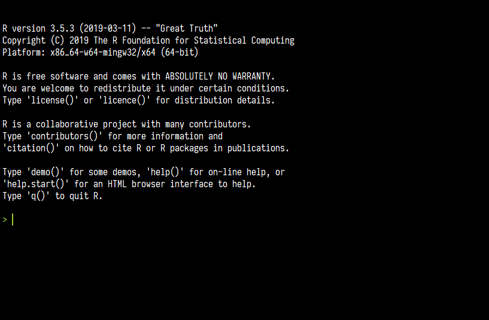

# Preface {-}

Purposes of the course: quantitative data management, processing and analysis with R, tidying, description, visualization, statistical analysis.

Getting help: ? command, Stackoverflow

> R is a **language** and **environment** for **statistical computing** and **graphics**.

Based on S language orginating from 1970's. Developed during 1990's and became public around 2000.

Language and environment. Programming language similar to any other but developed paricularly for data analysis. Flexible and extensible environment as opposed to many statistical packages. Command line interface.

Statistical computing and graphics. Includes many statistical procedures for various fields. Constantly extended by the community with novel methods. Abundant possibilities for plotting data


Free and open source as opposed to most statistical packages. Powerful. Allows for reproducibile analysis. Extensible. Active community. 

Command line interface



Apply functions on objects. Data is not constantly visible. No undo. Multiple ways to get the same result.

```{r include=FALSE}
# automatically create a bib database for R packages
knitr::write_bib(c(
  .packages(), 'bookdown', 'knitr', 'rmarkdown'
), 'packages.bib')
```
