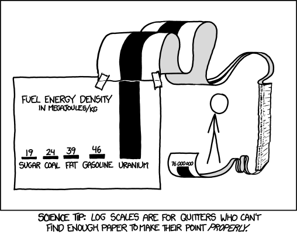

# Descriptive statistics

## Some elementary concepts

Absolute and relative numbers.

Percentages and percentage points.

## Normalizing and scaling

Normalization rescales values so that they range from 0 to 1. 

$$x_{normalized} = \frac{x - x_{min}{x_{max} - x_{min}}$$

Standarization rescales values so that the mean is 0 and standard deviation 1. Thus, the resulting values indicate how many standard deviations a value is from the mean.

$$x_{rescaled} = \frac{x - \mu}{\sigma}$$

`scale()`

## Frequency tables

`table()`, `prop.table()`, 

`aggregate()`, `by()`

## Measures of central tendency and quantiles...

`summary()`, `mean()`, `median()`, `mode()`, `sd()`,`var()`, `max()`, `min()`

`quantile()`

## Distributions

See: [www.stat.umn.edu](http://www.stat.umn.edu/geyer/old/5101/rlook.html)
