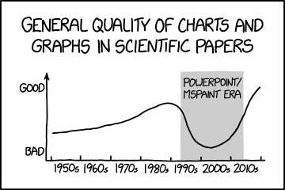

# Data visualization

## Basic principles

See: 

- [stat545.com](https://stat545.com/block015_graph-dos-donts.html)
- [robjhyndman.com](https://robjhyndman.com/hyndsight/graphics/)

## Getting started

See:

- [bookdown.org/rdpeng/exdata](https://bookdown.org/rdpeng/exdata/the-base-plotting-system-1.html)
- [www.flutterbys.com.au](http://www.flutterbys.com.au/stats/tut/tut5.1.html)

## Types of plots

`plot()`

`barplot()` (with `table()`)

`boxplot()`

`dotplot()`

`pairs`, `biplot()`

`histogram()`

`lines()`

`density()`

See: 

- [uc-r.github.io](https://uc-r.github.io/quickplots)
- [shiny.stat.ubc.ca](http://shiny.stat.ubc.ca/r-graph-catalog/)

## Adding elements

`legend()`

`text()` 

`abline()`

## Parameters

`mfrow()`

## Saving

`png()`

## Extending basic plotting with `ggplot2`

See: 

- [r-statistics.co](http://r-statistics.co/Complete-Ggplot2-Tutorial-Part1-With-R-Code.html)
- [ggplot2 cheatsheet](https://www.rstudio.com/wp-content/uploads/2015/03/ggplot2-cheatsheet.pdf)
