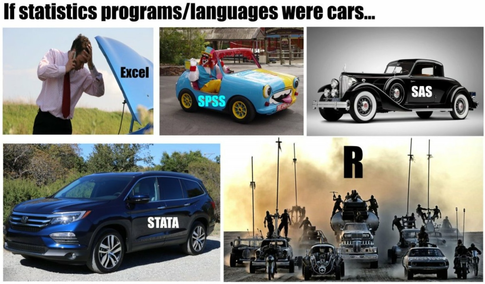
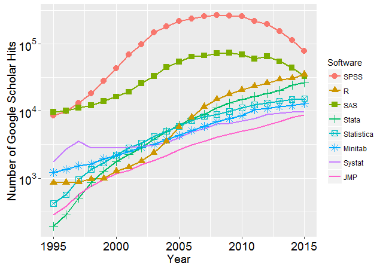
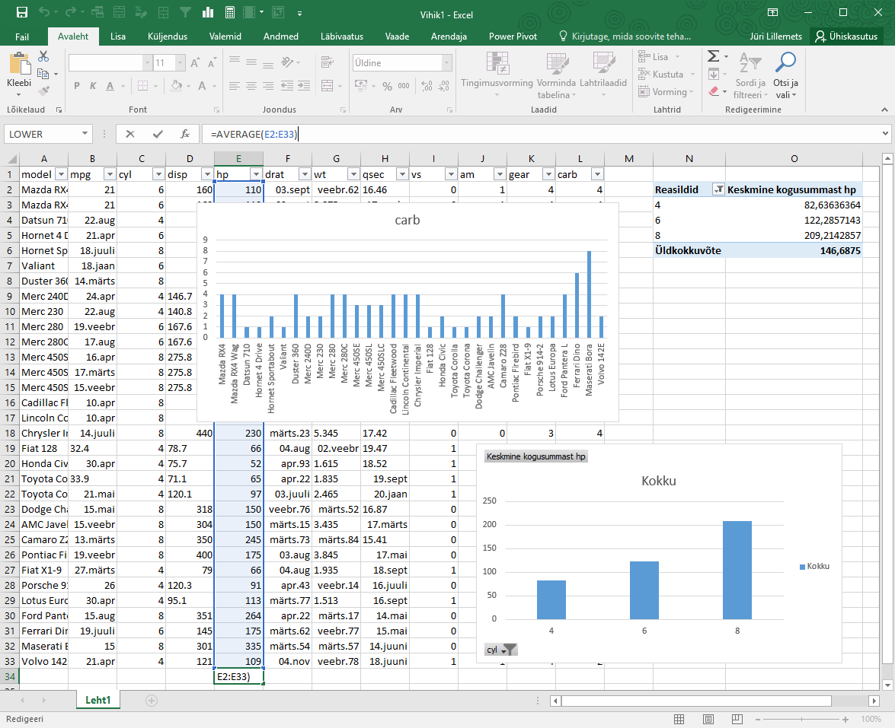

```{r setup, include = F}
# Settings
knitr::opts_chunk$set(include = T, eval = T, echo = T, message = F, warning = F)

# Working directory
knitr::opts_knit$set(root.dir = '/home/jrl/rcrs/pres')
```

class: center middle

## *"There are three kinds of lies: lies, damned lies, and statistics"*

???
Quantitative vs data and statistics

---

class: center middle


---

# .left[Ways to deal with data]

--

.width-80[]

---

class: center middle inverse

# Some words about R

---

# What?

## R is a .blue[language] and .blue[environment] for .red[statistical computing] and .red[graphics].

--

Based on S language orginating from 1970's. Developed during 1990's and became public around 2000.

---

## Language and environment

--

Programming language similar to any other but developed paricularly for data analysis

--

Flexible and extensible environment as opposed to many statistical packages

--

Command line interface

---

## Statistical computing and graphics

Includes many statistical procedures for various fields

--

Constantly extended by the community with novel methods

--

Abundant possibilities for plotting data

---

# Why? 

.width-60[]

---

# Why?

Free and open source as opposed to most statistical packages

--

Powerful

--

Allows for reproducibile analysis

--

Extensible

--

Active community

---

# How? 

Command line interface

--

.width-50[]

---

# How?

Apply functions on objects

--

Data is not constantly visible

--

No undo

--

Multiple ways to get the same result

---

class: center middle inverse

# Aims of the course

---

class: center middle

# .left[Before]

.width-60[]

---

# After

.pull-left[
``` {r, fig.height = 3}
hist(mtcars$hp, 20)
summary(mtcars$hp)
```
]

.pull-right[
``` {r}
summary(lm(hp ~ cyl, mtcars))
```
]

---

class: center middle inverse

That's it!

