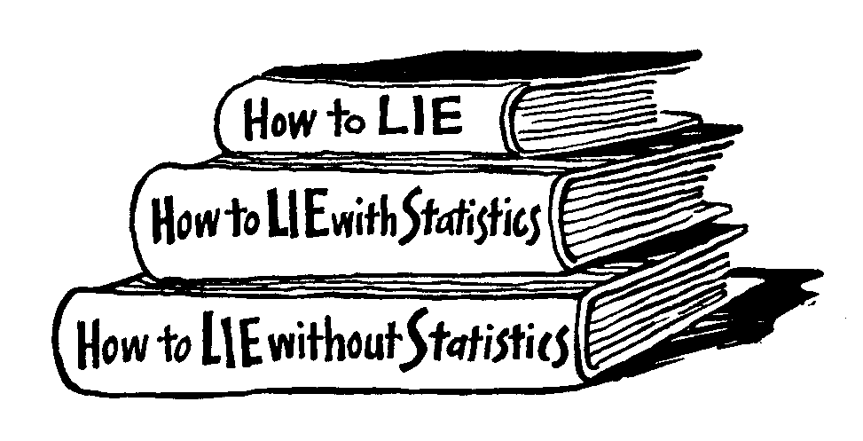
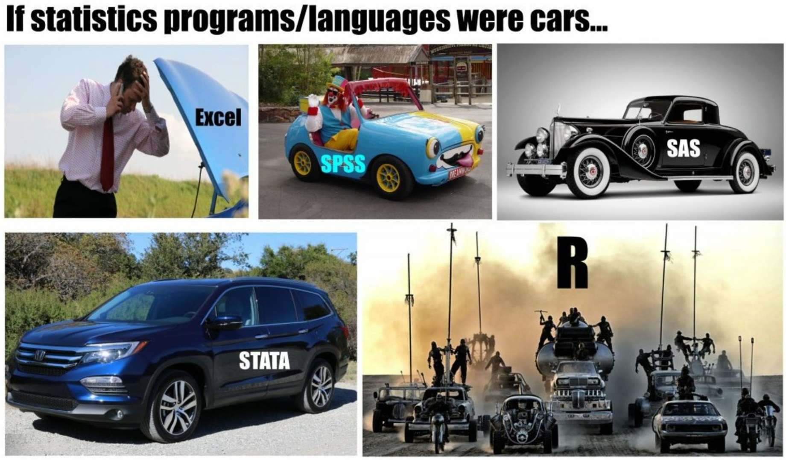
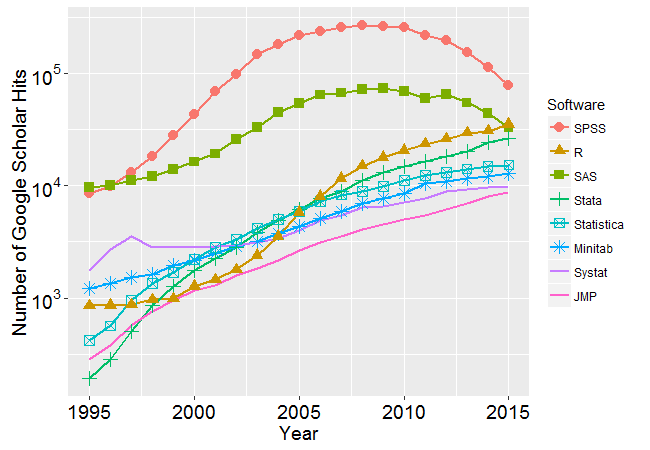
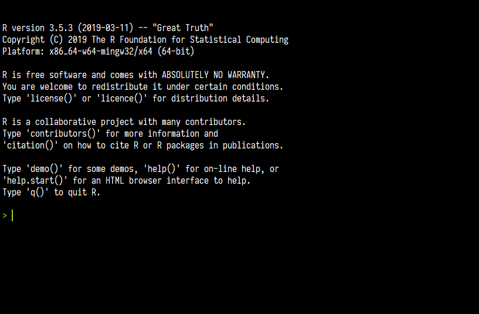
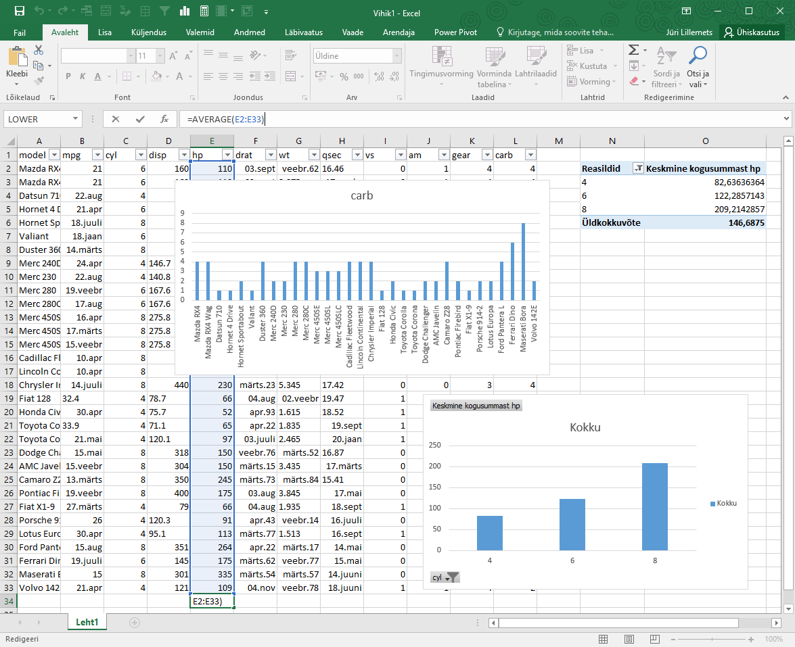

```{r setup, include = F}
# Settings
knitr::opts_chunk$set(include = T, eval = T, echo = T, message = F, warning = F)

# Working directory
knitr::opts_knit$set(root.dir = '/home/jrl/rcrs/slides')
```

# Moodle

Go to **moodle.hitsa.ee**.

Register to **MS.0825 Research methods**.

Tests, slides, reading materials.

---

# Time schedule of the meeting

``` {r, echo = F}
barplot(matrix(c(15,15,60,15,75)), 
  horiz = T, axes = F, 
  legend.text = c("Test", "Break", "Instructions", "Break", "Exercises"), 
  col = c('coral', 'gray', 'skyblue1', 'gray', 'skyblue4'))
axis(side = 1, at = seq(0, 180, 15), labels = seq(0, 180, 15))
```

---

# Quiz on previous knowledge

The results are irrelevant for your final grade.

11 questions, 30 minutes.

Multiple choice questions.

There may be multiple correct answers or only one.

---

class: middle

> "There are three kinds of lies: lies, damned lies, and statistics"

???
Quantitative vs data and statistics

---

class: center middle



---

# .left[Ways to deal with data]

--

.width-80[]

---

class: center middle inverse

# Some words about R

---

# What?

## R is a .blue[language] and .blue[environment] for .red[statistical computing] and .red[graphics].

--

Based on S language orginating from 1970's. Developed during 1990's and became public around 2000.

---

## Language and environment

--

Programming language similar to any other but developed paricularly for data analysis

--

Flexible and extensible environment as opposed to many statistical packages

--

Command line interface

---

## Statistical computing and graphics

Includes many statistical procedures for various fields

--

Constantly extended by the community with novel methods

--

Abundant possibilities for plotting data

---

# Why? 

.width-60[]

---

# Why?

Free and open source as opposed to most statistical packages

--

Powerful

--

Allows for reproducibile analysis

--

Extensible

--

Active community

---

# How? 

Command line interface

--

.width-50[]

---

# Why not?

--

A steep learining curve

--

Inconsistencies

--

Limited use of hardware

---

# How?

Apply functions on objects

--

Data is not constantly visible

--

No undo

--

Multiple ways to get the same result

---

class: center middle inverse

# Some dichotomies in statistics

---

# Descriptive vs inferential statistics

.pull-left[Descriptive

- Population
- Simple measures, e.g. mean
- Describing
]


.pull-right[Inferential

- Sample
- Point estimates and intervals
- Drawing inferences and generalizing
]

---

# Frequentist vs bayesian approach


.pull-left[Frequentist

- Traditional
- What's the probability of data given some estimate?
- Prior information is not relevant
- Single parametric inference
]


.pull-right[Bayesian

- Modern application
- What's the probability of an estimate?
- Construction of a prior
- Multiplication of an inference to get a posterior estimate
]

We will focus on the Frequentist approach.

---

class: center

.width-40[]

---

# Statistics vs data *science*, machine learning, aritficial intelligence ...

.pull-left[Statistics

- Less data
- Clean datasets
- Traditonal methods
- Mathematics and calculations
- Aim is to explain
]


.pull-left[Data *science*

- Big data
- Data in various formats and untidy
- New methods
- Programming approach
- Aim is to predict
]

---

class: center


---

class: center middle inverse

# About the course

---

# Topics

- R use
  - Basic data management in R
  - R in practice
  - Extending basic R functionality
- Descriptive statistics
  - Introduction to descriptive statistics
  - Data visualization
  - Measures of association
- Inferential statistics and regression modelling
  - Introduction to inferential statistics
  - Ordinary least squares (OLS)
  - Generalized linear models (GLM)
  - GLM for categorical variables
  - Panel data methods

---

# What you should learn

--

Acquire skills on how to use R for managing and analyzing data

--

Become able to solve common problems in data management and preparation for analysis

--

Gain an understanding of the underlying ideas and concepts in statistics, especially inferential statistics

--

Get acquainted with some most common methods in statistics and know when to implement them

--


Be prepared to choose and apply a suitable statistical method for the research problem your master's thesis (and perhaps in your future career)

---

class: center middle

# .left[Before]

.width-60[]

---

# After

.pull-left[
``` {r, fig.height = 3}
hist(mtcars$hp, 20)
summary(mtcars$hp)
```
]

.pull-right[
``` {r}
summary(lm(hp ~ cyl, mtcars))
```
]

---

# Grading

The final grade for the course consists of the following elements

Qua**nt**itative part: 50%

> 10 short tests, 5% each

Qua**l**itative part: 20%

> Individual assignments

Master's thesis project: 30%

> Project document and presentation

---

class: center middle inverse
