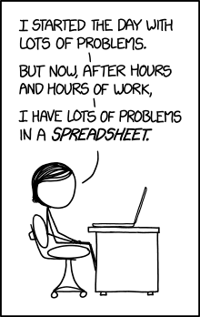

```{r setup, include = F}
# Settings
knitr::opts_chunk$set(include = T, eval = T, echo = T, message = F, warning = T, error = T)

# Working directory
knitr::opts_knit$set(root.dir = '/home/jrl/rcrs/slides')
```

class: center middle inverse

# Basic R use

---

# Arithmetics

R recognizes basic aritmetic operators.

``` {r, eval = F}
5 + 2 # Addition
5 - 2 # Subtraction
5 * 2 # Multiplication
5 / 2 # Division
```

--

Some less common operations are also possible.

``` {r}
5 %% 2 # Return only the remainder of division
5 %/% 2 # Return the result of division without remainder
```

---

A bit more advanced mathematical expressions.

``` {r}
5 ^ 2 # 5 to the power of 2
sqrt(25) # Square root of 25
exp(1) # Exponent
log(5) # Natural logarithm
```

---

Finally, the order of operations can be set with parenthesis.

``` {r}
5 - 2 * 3
(5 - 2) * 3
```

---

# Relational operators

For the comparison of two objects, relational operators are used in R. 

``` {r, eval = F}
5 > 2 # 5 is greater than 2
5 < 2 # 5 is less than 2
2 >= 2 # 2 is equal to or greater than 2
2 >= 5 # 5 is equal to or less than 2
5 == 2 # 5 is equal to 2
2 != 2 # 2 is not equal to 2
```

--

If the sides of the operator contain uneven number of elements, these will be recycled. 

``` {r}
5 > c(2, 5, 12) # 5 is greater than 2, 5 is greater than 5
```

---

Naturally, all of these operators also work on character objects.  

``` {r}
"String" == "String"
"String" != "String"
```

---

Operator `%in%` evaluates whether or not an identical element is also included in another object.

``` {r}
5 %in% c(2, 5) # 5 is an element of a vector containing 2 and 
"String" %in% c(2, 5)
```

---

# Logical operators

Boolean logic is useful to compare objects of type logical (i.e. `TRUE` and `FALSE`)

``` {r}
TRUE | FALSE # True or false is true
TRUE & FALSE # True and false are both true
!TRUE # The opposite of true
```

---


---

# Common use for the operators

Subsetting

``` {r}
beans <- agridat::besag.beans
beans[beans$gen ==  'Metissa' & beans$yield > 400, ]
```

---

For `ifelse()`

``` {r}
head(beans)
beans$yield <- ifelse(beans$col >= 4, beans$yield + 100, beans$yield)
head(beans)
```

---

Control structures

``` {r}
someSwitch <- 2
if (exists('someSwitch') & someSwitch > 1) print(">1") else print("<=1 or NA")
```

---

# Assignment

Data in R is stored in objects. 

``` {r}
(someElement <- 5)
(someElement = 5)
someElement == 5
```

---

class: middle

> There are only two hard things in Computer Science: cache invalidation and naming things.

.right[Phil Karlton]

---

Object names can contain numbers, letters and punctuation marks but never start with a number. 

``` {r, error = T}
1number <- 12
oneNumber <- 1
a.number <- 2
a_number <- 5
number10 <- 10
```

---

Note that the assignment operator must always be enclosed with spaces, otherwise R might evaluate the assignment as a comparison if you accidentally type a space.

``` {r}
someNum <- 5 # Assign 5 to someNum
someNum< -5 # someNum is greater than -5
```

---

# Set operations

Although rarely necessary, operations on sets can be helpful to return specific elements from vectors.

``` {r}
a <- c(2, 2, 5, "String")
b <- c(1:3)
union(a, b) # All elements of a and b
intersect(a, b) # Elements in both a and b
setdiff(a, b) # Elements in a but not in b
setequal(a, b) # Do a and b contain all the same elements?
```

The set functions ignore duplications and ordering of elements. 

---

# Help

To get help on any function, type its name preceded by a question mark, e.g. `?union`

---

class: center middle inverse

# Data types and structures

---

# Levels of measurement

Traditional ([S. S. Stevens](http://psychology.okstate.edu/faculty/jgrice/psyc3214/Stevens_FourScales_1946.pdf))

- Nominal
- Ordinal
- Interval
- Ratio

---

# Conventional scales

- Categorical/qualitative
  - Binary/dichotomous/boolean/logical
  - Nominal
  - Ordinal/ranked
- Numeric/quantitative
  - Discrete
  - Continuous
      - Interval
      - Ratio

---

# In R

Levels of measurement

- Logical
- Character
- Integer
- Double (floating point numbers)

--

Types of data

- logical
- character
- factor
- numeric
    - integer
    - double


---

# Factors

---

# Missing values in R

- NA - Not available/applicable
- NaN - Not a number
- Inf - positive infinite
- -Inf - Negative infinite

--

Subsetting missing values: `is.na()`, `is.nan()`, `is.infinite()`, `is.finite()`.

---

How to remove missing values from data.frame?

``` {r}
potatoes <- agridat::yates.missing
potatoes[is.na(potatoes$y), ] # Return rows where infection intensity is missing
potatoes <- potatoes[!is.na(potatoes$y), ]
```

---

# Types of objects in R

| Dimensions | Homogenous | Heterogenous |
| --- | --- | --- |
| 1 | Vector, `c()` | List, `list()` |
| 2 | Matrix, `matrix()` | Data frame, `data.frame()` |
| >2 | Array, `array()` | |

--

To determine type and class of an object: `typeof()`, `class()`, `is.*...()*`

---

To treat object as if it was of a certain type: `as.*...()*`.

``` {r}
(someNumbers <- c(1, 2, 5, 10))
as.list(someNumbers)
```

---

class: center middle inverse

# Subsetting

---

# Vectors

``` {r}
(someVector <- letters[1:12])
someVector[2]
someVector[-2]
someVector[c(1, 3, 5)]
```

---

# Lists

``` {r}
(someList <- list(Letters = letters[1:12], Numbers = 1:10))
someList$Letters
someList[1]
```

---

``` {r}
someList[[1]]
someList[[1]][1]
```

---

# Matrices

``` {r}
(someMatrix <- matrix(1:9, 3, 3))
someMatrix[1]
someMatrix[1, ]
someMatrix[, 1]
```

---

# Data.frames

``` {r}
barley <- agridat::student.barley[1:6, ]
barley
```

---

``` {r}
barley[1]
barley[[1]]
```

---

``` {r}
barley$year
barley[, 1]
barley[, 1, drop = F]
barley[1:3, ]
```

---

# Using logical operators or indexes

.pull-left[
Using logical operators. 

``` {r}
barley$farmer == 'McCarthy'
barley[barley$farmer == 'McCarthy', ]
```
]

.pull-right[
Using indexes. 

``` {r}
which(barley$farmer == 'McCarthy')
barley[which(barley$farmer == 'McCarthy'), ]
```
]

---

# Sorting data frame rows

`order()` returns indexes while `sort()` returns the elements.

``` {r}
sort(barley$yield)
order(barley$yield)
barley[order(barley$yield), ]
```

---

# Workspace management

To set working directory for the session: `setwd()`. 

To return current working directory: `getwd()`. 

To list all objects on workspace: `ls()`. 

To remove an object: `rm()`, and to remove all objects: `rm(list = ls())`. 

On Windows filesystem, `\` needs to be escaped (`\\`) or replaced with `/`. 

---

# File management

To remove file: `file.remove()`

To move file: `file.copy()`

To test if file exists: `file.exists()`

---

# Data sources and managing data

Natively R supports only plain text (e.g. `.csv`) and its native (`.Rdata` and `.Rds`) data formats. 

``` {r, eval = F}
someData <- read.csv('some_file.csv`, stringsAsFactors = F)
someData <- read.table('some_file.csv`, header = T, sep = ',', stringsAsFactors = F)
```

--

Data can also be downloaded directly from a url.

``` {r}
sharma <- read.csv('https://raw.githubusercontent.com/kwstat/agridat/master/data-unused/sharma.mutation1.csv')
head(sharma)
```

---

It's usually easier to save data in a plain text format before loading to R. But this is not always possible.

To load data created by statistical packages (Stata, SPSS, SAS): functions in the `foreign()` package.

To read *.xls* and *.xlsx*: `read_excel()` from the `readxl` package.

To edit *.xlsx* workbooks: the `openxlsx` package.

---

class: center middle




---

class: center middle


---

When some data is used exclusively in R, the native R data formats should be used as these allow more efficient data compression. 

To save all objects on workspace:

``` {r, eval = F}
save.image('some_file.Rdata') # Save all objects on workspace
load('some_file.Rdata') # Load all saved objects to workspace
```

--

Sometimes it is necessary to only save a single object from workspace.

``` {r, eval = F}
saveRDS(someObject, 'some_file.Rds')
readRDS('some_file.Rds')
```

---

# Understanding a dataset

Get the first or last (by default 6) rows with `head()` or `tail()`.

``` {r}
soy <- agridat::nass.soybean
head(soy)
tail(soy)
```

---

Print the structure of an object with `structure()` or `str()`.

``` {r}
str(soy)
```
---

Get summary statistics for each column in a data frame using `summary()`.

``` {r}
summary(soy)
```

---

List names of all the columns of data frame with `names().`

``` {r}
names(soy)
```

---

class: center middle inverse

# Some R principles

---

class: middle

> To understand computations in R, two slogans are helpful:
>
> - Everything that exists is an object.
> - Everything that happens is a function call.

.right[John Chambers]

---

# Function arguments

Function arguments are read by (1) complete name, (2) partial name, or (3) position.

``` {r}
quantile(x = mtcars$mpg, probs = .9, na.rm = F, names = T)
quantile(probs = .9, names = T, na.rm = F, x = mtcars$mpg)
quantile(mtcars$mpg, .9, F, T)
quantile(pr = .9, x = mtcars$mpg, na = T)
```

---

# Vectors need to be explicity defined as such

Any vector needs to be passed inside the `c()` function.

``` {r, error = T}
someVector <- letters[1:12]
someVector[1,2,3,5,8] # This is does NOT work
someVector[c(1,2,3,5,8)] # This is does work
```

---

# Characters must be in quotation marks

Othewise R will interpret them as references to objects and attempts to find them.

``` {r, error = T}
someVector <- c(a, b, c) # This attempts to add existing objects a, b and c
someVector <- c('a', 'b', 'c') # This adds character elements
```

---

# Environments

R searches for objects in an environment where an operation is done. When it does not find an object there, it will incrementally search in higher environments.

``` {r}
sum(1, 10)
sum <- function(...) Reduce(`-`, ...)
sum(1, 10)
```

---

``` {r}
a <- "Cow" 
say <- function() print(a)
say()
say <- function() {a <- "Sheep"; print(a)}
say()
```

---

# Recycling

``` {r}
(a <- 1:2)
(b <- 1:5)
a + b
```

---

# Lazy evaluation

``` {r}
someFun <- function(x, y) print(x)
someFun(x = "Hello world!")
```

---

class: center middle inverse

